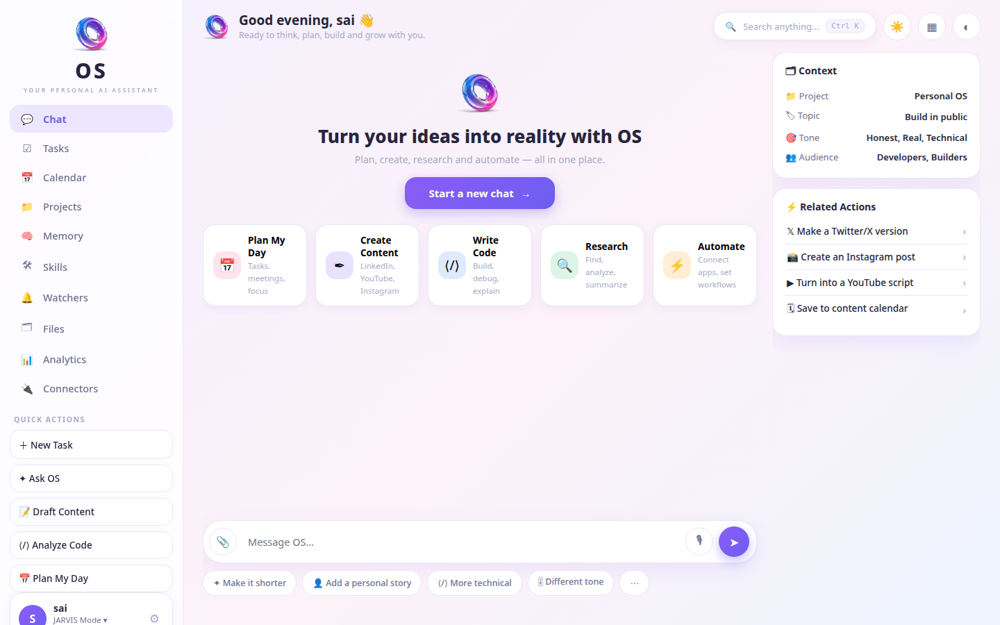
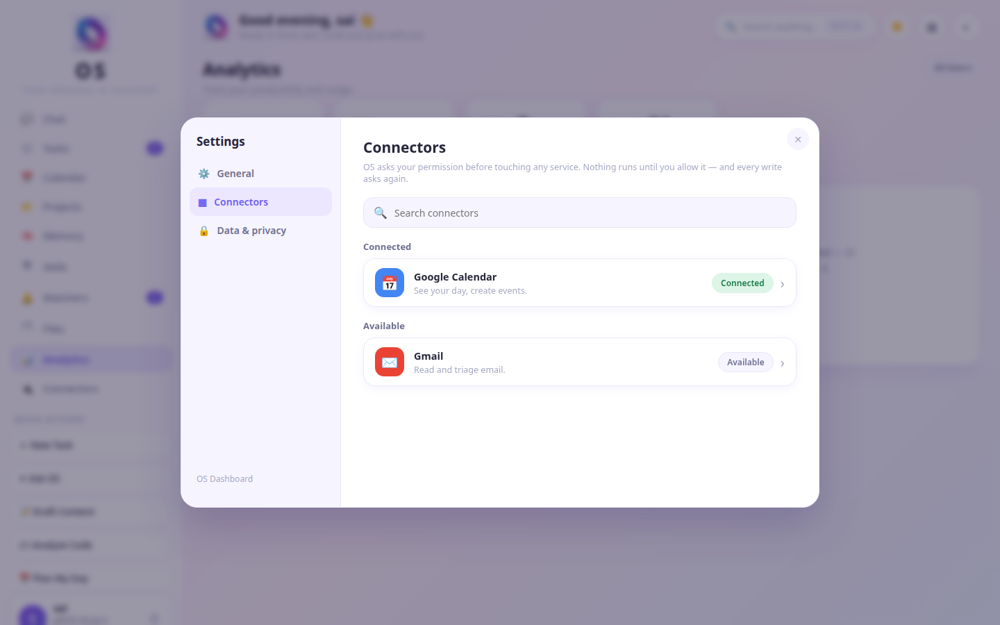
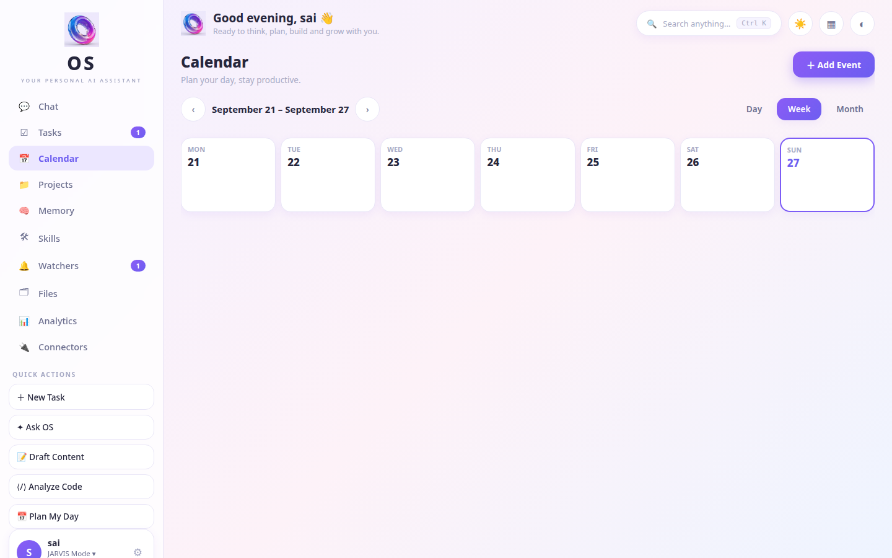
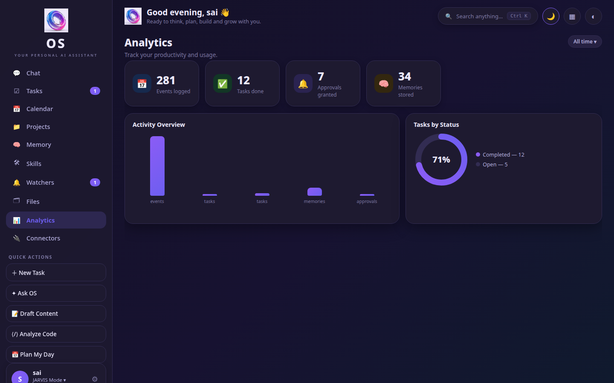

# J.A.R.V.I.S. — Just A Rather Very Intelligent System

[](LICENSE)
[](pyproject.toml)
[](#)
[](#testing)

A **local-first AI assistant that does things**. Chat with it in your browser and it books meetings, opens GitHub issues, sends messages, and manages your calendar — **every write approved by you first**. It can also talk to you out loud, mic and speaker, entirely on-device. Runs at ₹0: no paid APIs, no cloud required.

## Screenshots

| Chat | Connectors |
|---|---|
|  |  |

| Calendar | Dark mode |
|---|---|
|  |  |

## Quickstart

One command, then open **http://localhost:3000**:

```bash
docker compose up        # builds once, keeps your data in a volume
```

Or without Docker:

```bash
pip install ".[dashboard,google]"
python cli.py dashboard --port 3000
```

You'll need a local LLM for chat: `ollama serve && ollama pull qwen3:8b`.

## What it does

**The dashboard is the product.** Chat executes real work through connectors — *"schedule a meeting tomorrow at 4"* creates a real Google Calendar event, *"send this to GitHub"* opens a real issue. The UI covers chat, tasks, calendar (day/week/month), projects, memory, skills, watchers, files, analytics, and settings.

**Connectors (15 real adapters, zero mocks).** Google Calendar, Gmail, Sheets, Drive, YouTube, GitHub, Notion, Telegram, Slack, Discord, Spotify, WhatsApp, LinkedIn, X, Instagram.

- **Settings → Connectors**: Connected / Available groups, search, per-service setup guides, OAuth sign-in, credential storage, test & revoke.
- A connector counts as *connected* only after permission grant **+** credentials **+** a live health check. No fake green dots.
- Per-connector defaults: default GitHub repo, Slack channel, Notion parent page, spreadsheet.
- **Honest free tier**: GitHub, Notion, Telegram/Slack/Discord bots, Google OAuth apps, and YouTube search all have free paths. X posting needs a paid API tier and the UI says so instead of failing silently.

**Safety model.** Reads execute immediately; **every external write creates an approval first** — shown in chat and in the approval rail — and only executes after you approve. Approvals bind the exact tool, arguments, and content hash: changed parameters invalidate the approval, and rejected/expired approvals guarantee zero handler calls. Credentials are encrypted at rest and never echoed.

**MCP bridge.** Every connected service is also an MCP tool at `POST /mcp` (`initialize`, `tools/list`, `tools/call`, dotted names like `telegram.send_message`). Write tools return a pending approval instead of executing.

**Voice mode.** Fully on-device pipeline: mic → echo cancellation → VAD → speech-to-text → conversation engine → text-to-speech → speaker, with automatic barge-in (talk over it mid-sentence and it stops). See [the pipeline](#voice-pipeline) below.

## Architecture

```
web/                    FastAPI dashboard + static UI (chat, connectors, approvals)
server/conversation/    Intent router, tool calling, memory, state machine
server/connectors/      15 service adapters + credential vault + health checks
server/approvals/       Approval engine (binds tool + args + content hash)
server/mcpbus/          MCP JSON-RPC bridge over connected services
server/teams/           Supervisor + worker agent teams (phased, see RELEASE notes)
config/settings.yaml    All configuration (local.yaml overrides, gitignored)
```

## Voice pipeline

| Stage | Component |
|---|---|
| Microphone capture | sounddevice input stream, selectable device |
| Echo cancellation | NLMS adaptive filter (~21 dB reduction) |
| Voice activity detection | Silero VAD (energy fallback) |
| Speech → text | faster-whisper, VAD-gated streaming |
| Conversation | state machine + intent router + tools + memory + Ollama |
| Text → speech | PocketTTS |
| Barge-in | VAD watchdog interrupts playback on speech |

```bash
# Voice setup
python -m venv .venv && source .venv/bin/activate
pip install -r requirements.txt
pip install -r requirements-voice.txt   # mic/speaker/STT/TTS/VAD
ollama serve && ollama pull qwen3:8b

python cli.py            # text mode
python voice_cli.py      # voice mode (needs mic + speaker)
```

JARVIS is precise, unfailingly polite, and dry-witted — he addresses you as "sir" and keeps spoken replies to a few sentences. Full trait list in `config/settings.yaml` → `personality:`.

## Configuration

Everything lives in `config/settings.yaml` (`config/local.yaml` overrides it, gitignored):

```yaml
personality:
  name: JARVIS
voice:
  input_device: null      # null = default; or match by name / index
  vad_backend: silero
  aec: nlms
  stt_model: small
  tts_engine: pocket-tts
```

Google connectors need a one-time [Google Cloud OAuth client](https://console.cloud.google.com/apis/credentials) (desktop app, redirect `http://localhost:3000/api/connectors/google/oauth/callback` — the in-app setup guide walks you through it).

## Testing

```bash
pytest tests/ -q     # 313+ tests
```

Covers the approval invariants (no double-execution, arg-binding, expiry guarantees), connector health gating, the voice pipeline (including a real TTS→STT roundtrip: PocketTTS synthesizes, faster-whisper transcribes back word-perfect), and the dashboard API.

## Docs

- `docs/RELEASE_v1.md` — v1.0.0 foundation release notes (what's in, what's deferred, known limitations)
- `AUDIT_REPORT.md` — full component audit (74/100)
- `COMPLETION_REPORT.md` — what was built to complete the voice pipeline
- `HARDWARE_TEST.md` — laptop mic/speaker validation checklist

## Known limitations

- Voice hardware path is validated via checklist, not CI — run `HARDWARE_TEST.md` on your machine.
- Browser/computer autonomy is intentionally deferred until the foundation is stable.
- Live connector authentication (Google OAuth, bot tokens) can't be tested in CI — the health-check gate exists precisely so "connected" always means verified.

## Credits

Voice-pipeline patterns adapted from [OpenJarvis](https://github.com/open-jarvis/OpenJarvis) (Apache-2.0) — see `COMPLETION_REPORT.md` for per-file attribution. Built by [Sai Sankeerth Voorugonda](https://github.com/SaiSankeerth-dev). MIT licensed.
